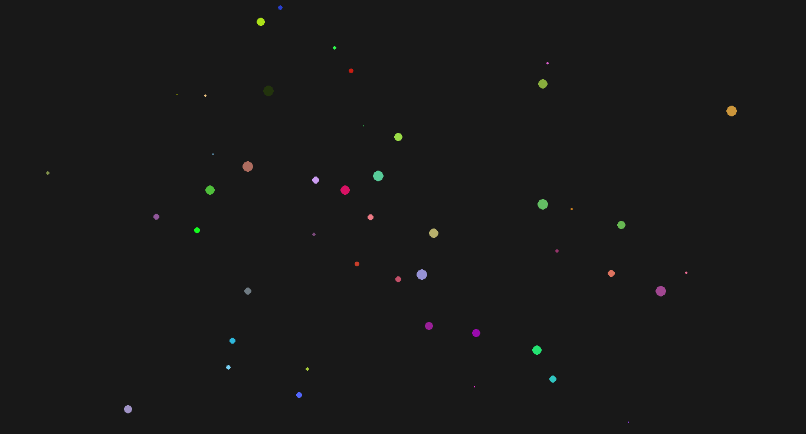

# Simple 2D particle simulator



Simulates randomly placed 2D disks and their interactions according to Newtonian physics. This is enough to observe some interesting behaviour, mainly orbits and small "solar systems". Collisions are handled by merging the particles, similar to how planets work.

To run on Linux clone the repo and inside do:

```
python3 -m venv venv
source ./venv/bin/activate.sh
pip install pygame
python3 sym.py
```

How to use:

- Move with _hjkl_ like in vim

- Zoom in and out with _+_ and _-_

- Press _n_ to cycle through all the particles.

- Press _m_ to see the particle's mass, press again to go back to colors.

- Press _s_ to increase the visual radious of the particles so you can see them from far away, press again to go back to actual radious.

- Press _t_ to make time pass faster.

- Press _r_ to make time pass slower.


